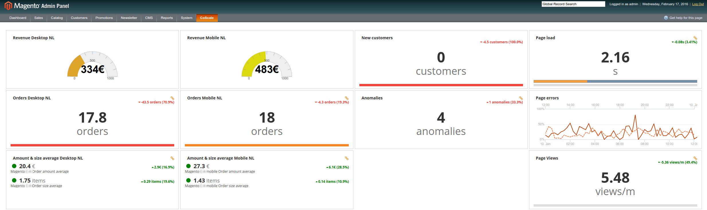

# CoScale Magento dashboard (BETA)

This Magento module can be used to show a CoScale dashboard inside the Magento administration interface. The module requires some custom configuration after installing.

## Installation

1. Copy files into Magento Installation
2. Open `app/code/community/CoScale/Dashboard/controllers/Adminhtml/CustomController.php` and set the following variables. You need to set them with a CoScale public dashboard url. You can find the instructions to get such an url [here](http://docs.coscale.com/dashboard/sharing/).

    `private $coscale_dashboard_main = '';`

    `private $coscale_dashboard_devops = '';`

    `private $coscale_dashboard_developers = '';`

3. Everything is setup, you can now view your CoScale dashboards inside Magento.
